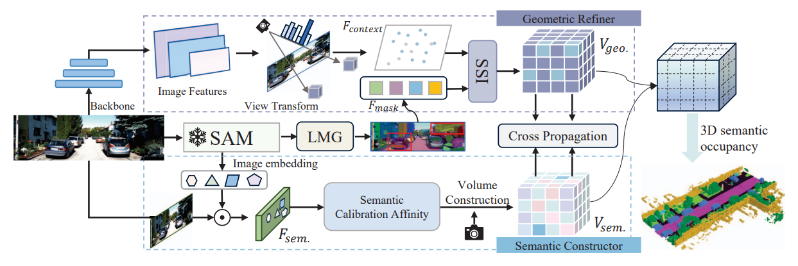
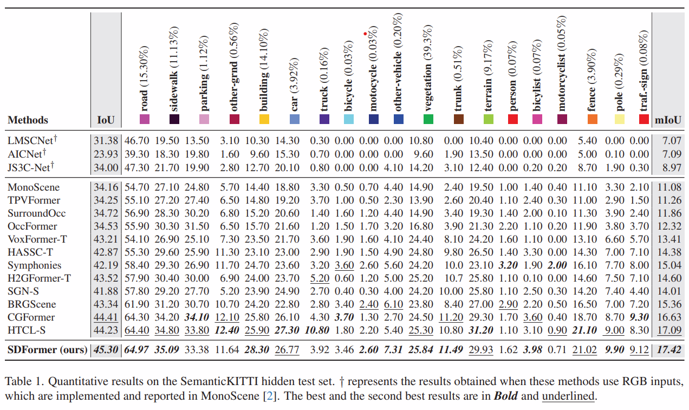

<div align="center">

#  <span style="font-size: 1.5em; color: #0366d6;">**[ICCV2025]SDFormer: Vision-based 3D Semantic Scene Completion via SAM-assisted Dual-channel Voxel Transformer**</span>


### <span style="color: blue;">**ICCV 2025🏝️**</span>
</div>
The official code of ICCV 2025 accepted paper "SDFormer: Vision-based 3D Semantic Scene Completion via SAM-assisted Dual-channel Voxel Transformer".


## 📰 News
- [2026/2]: 💥 New Mehtod is accepted by CVPR 2026: Learning Spatial-Temporal Consistency for 3D Semantic Scene Completion.
- [2025/10]: [Paper](https://openaccess.thecvf.com/content/ICCV2025/papers/Xue_SDFormer_Vision-based_3D_Semantic_Scene_Completion_via_SAM-assisted_Dual-channel_Voxel_ICCV_2025_paper.pdf) is published in **ICCV 2025**.[](https://openaccess.thecvf.com/content/ICCV2025/papers/Xue_SDFormer_Vision-based_3D_Semantic_Scene_Completion_via_SAM-assisted_Dual-channel_Voxel_ICCV_2025_paper.pdf)

## 🏗️ Framework


## 📝 Abstract
Vision-based semantic scene completion (SSC) is able to predict complex scene information from limited 2D images, which has attracted widespread attention. Currently, SSC methods typically construct unified voxel features containing both geometry and semantics, which lead to different depth positions in occluded regions sharing the same 2D semantic information, resulting in ambiguous semantic segmentation.
To address this problem, we propose **SDFormer**, a novel SAM-assisted Dual-channel Voxel Transformer framework for SSC. We uncouple the task based on its multi-objective nature and construct two parallel subnetworks: a semantic constructor (SC) and a geometric refiner (GR). The SC utilizes the Segment Anything Model (SAM) to construct dense semantic voxel features from reliable visible semantic information in the image. The GR accurately predicts depth positions and then further adjusts the semantic output by SAM.
Additionally, we design a Semantic Calibration Affinity to enhance semantic-aware transformations in SC. Within the GR, Shape Segments Interactive and Learnable mask generation module to emphasize the spatial location of semantics to obtain fine-grained voxel information. Extensive qualitative and quantitative results on the SemanticKITTI and SSCBench-KITTI360 datasets show that our method outperforms state-of-the-art approaches.

📊 Dataset Comparison

---
## 🛠️ Step-by-Step Installation
Following the [mmdetection3d installation guide](sslocal://flow/file_open?url=https%3A%2F%2Fmmdetection3d.readthedocs.io%2Fen%2Flatest%2Fgetting_started.html%23installation&flow_extra=eyJsaW5rX3R5cGUiOiJjb2RlX2ludGVycHJldGVyIn0=).

```bash
# 1. Create conda environment with Python 3.7 (Python >3.7 may cause open3d-python issues)
conda create -n sdformer python=3.7 -y
conda activate sdformer

# 2. Install PyTorch and torchvision (CUDA 11.3)
conda install pytorch==1.10.1 torchvision==0.11.2 torchaudio==0.10.1 cudatoolkit=11.3 -c pytorch -c conda-forge

# 3. (Optional) Install gcc>=5 in conda env
conda install -c omgarcia gcc-6  # gcc-6.2

# 4. Install mmcv-full
pip install mmcv-full==1.4.0

# 5. Install mmdet and mmseg
pip install mmdet==2.14.0
pip install mmsegmentation==0.14.1

# 6. Install mmdet3d from source
git clone https://github.com/open-mmlab/mmdetection3d.git
cd mmdetection3d
git checkout v0.17.1  # Other versions may not be compatible
python setup.py install
# Check your CUDA version for mmdet3d if encountered import problem

# 7. Install other dependencies
pip install timm
pip install open3d-python
pip install PyMCubes
```

## 📂 Data Preparation

a. You need to download:

- The Odometry calibration ([Download odometry data set (calibration files)](https://www.cvlibs.net/datasets/kitti/eval_odometry.php)) and the RGB images ([Download odometry data set (color)](https://www.cvlibs.net/datasets/kitti/eval_odometry.php)) from [KITTI Odometry website](https://www.cvlibs.net/datasets/kitti/eval_odometry.php), extract them to the folder `data/occupancy/semanticKITTI/RGB/`.
- The Velodyne point clouds ([Download data_odometry_velodyne](https://www.cvlibs.net/download.php?file=data_odometry_velodyne.zip)) and the SemanticKITTI label data ([Download data_odometry_labels](http://www.semantic-kitti.org/assets/data_odometry_labels.zip)) for sparse LIDAR supervision in training process, extract them to the folders `data/lidar/velodyne/` and `data/lidar/lidarseg/`, separately.

b. Prepare KITTI voxel label (see sh file for more details):

```bash
bash process_kitti.sh
```


## 🚀 Training & Evaluation

**Single GPU Operations**

**Training**

```bash
export PYTHONPATH="."
python tools/train.py \
            projects/configs/sdformer/semantickitti/baseline_semantickitti.py
```

**Evaluation**

```bash
export PYTHONPATH="."
python tools/test.py \
            projects/configs/sdformer/semantickitti/baseline_semantickitti.py \
            pretrain/sdformer_base_semantickitti.pth \
```

## 🙏 Acknowledgements

We sincerely thank the authors of the following excellent open-source projects:

- [MonoScene](https://github.com/astra-vision/MonoScene)
- [BRGScene](https://github.com/Arlo0o/StereoScene)
- [SAM](https://github.com/facebookresearch/segment-anything)
- [HTCL](https://github.com/Arlo0o/HTCL?tab=readme-ov-file)
- [mmedt3d](https://github.com/open-mmlab/mmdetection3d)

## 📌 Citation

If you find this project useful in your research, please consider cite:

```bash
@inproceedings{xue2025sdformer,
  title={SDFormer: Vision-based 3D Semantic Scene Completion via SAM-assisted Dual-channel Voxel Transformer},
  author={Xue, Yujie and Pi, Huilong and Zhang, Jiapeng and Qin, Yunchuan and Tang, Zhuo and Li, Kenli and Li, Ruihui},
  booktitle={Proceedings of the IEEE/CVF International Conference on Computer Vision},
  pages={26837--26847},
  year={2025}
}
```


